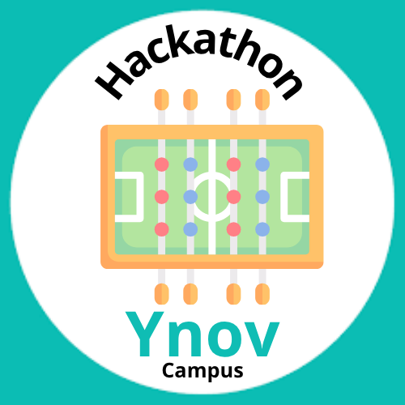

<table width="100%" border="0" cellspacing="0" cellpadding="0">
<tr>
<td align="left"><h1>Hackathon - Ynov Toulouse 2025</h1></td>
<td align="right"></td>
</tr>
</table>

> Ce repository contient les ressources ainsi que le code source développé lors du hackathon Ynov Toulouse 2025.

Cette template de README est un guide pour vous aider à structurer votre rendu de projet. N'hésitez pas à l'adapter ou surtout à le compléter avec des sections supplémentaires si nécessaire.

## Contexte

Et si on réinventait l’expérience babyfoot à Ynov ? L’objectif de ce hackathon est de moderniser et digitaliser l’usage des babyfoots présents dans le Souk pour créer un service _next-gen_, pensé pour près de 1000 étudiants !

Que ce soit via des gadgets connectés, un système de réservation intelligent, des statistiques en temps réel ou des fonctionnalités robustes pour une utilisation massive, nous cherchons des solutions innovantes qui allient créativité et technologie.

Toutes les filières sont invitées à contribuer : Dev, Data, Infra, IoT, Systèmes embarqués… chaque idée compte pour rendre le babyfoot plus fun, plus pratique et plus connecté.

Votre mission : transformer le babyfoot classique en expérience high-tech pour Ynov !

Bienvenue dans le Hackathon Ynov Toulouse 2025 !

> Retrouvez vos guidelines techniques dans le fichier [SPECIFICATIONS.md](./SPECIFICATIONS.md).

> P.S C'est un projet de groupe, pas autant de sous-projets que de filières dans votre équipe. Travaillez ensemble pour un seul et même projet au nom de votre équipe toute entière. Les guidelines sont là pour vous aider, pas pour vous diviser. Profitez de ce moment pour apprendre à travailler ensemble, partager vos compétences, et créer quelque chose d'unique.

## Equipe

- Dev' FullStack 1 : NOM Prénom
- Dev' FullStack 2 : NOM Prénom
- Dev' FullStack 3 : NOM Prénom
- Cloud & Infrastructure 1 : NOM Prénom
- Cloud & Infrastructure 2 : NOM Prénom
- IA & Data 1 : NOM Prénom
- IoT/Mobile / Systèmes Embarqués 1 : NOM Prénom

> Préciser qui est le porte parole de l'équipe, c'est lui qui répondra aux questions si nécessaire.

## Table des matières

- [Contexte](#contexte)
- [Equipe](#equipe)
- [Contenu du projet](#contenu-du-projet)
- [Technologies utilisées](#technologies-utilisées)
- [Architecture](#architecture)
- [Guide de déploiement](#guide-de-déploiement)
- [Etat des lieux](#etat-des-lieux)

## Contenu du projet

> Décrivez brièvement le projet, son objectif. Utilisez une vue business pour décrire ce que votre produit/service apporte à vos utilisateurs.

## Technologies utilisées

> Ici, listez les principales technologies, en expliquant pourquoi vous les avez choisies. Tout choix technique, langages, frameworks doit être justifié. (Parce que vous maîtrisez déjà la techno, parce que c'est la plus adaptée au besoin, parce que c'est la plus innovante, etc.)

## Architecture

> Faite un schéma simple de l'architecture technique de votre solution. Chaque service/composant est un bloc, et les interactions entre les blocs sont des flèches. Vous pouvez utiliser des outils comme [draw.io](https://app.diagrams.net/), ou encore [Excalidraw](https://excalidraw.com/) pour créer vos schémas. C'est une vue d'ensemble, pas un détail de chaque composant. Chacun d'entre vous doit être capable d'expliquer cette architecture.

## Guide de déploiement

> Expliquez comment déployer votre application **EN MOINS DE LIGNES DE COMMANDE POSSIBLES**. Docker, Ansible, Terraform, Scripts Shell... Le but est de pouvoir déployer votre application en une seule commande ou presque.

Exemple de lancement en **une seule commande**:

[Références Proxmox HelperScripts](https://github.com/community-scripts/ProxmoxVE/tree/main/install)

> /!\ IMPORTANT /!\ : Votre projet sera déployé sur une machine **LINUX** (Debian/Ubuntu), avec 4Go de RAM et 2 CPU (x86_64). Assurez-vous que votre application peut fonctionner dans ces conditions. Il n'y aura pas de "Ca marche sur mon Mac." ou encore "Si on alligne les astres sur Windows XP ça passe.".

## Etat des lieux

> Section d'honnêteté, décrivez ce qui n'a pas été fait, ce qui aurait pu être amélioré, les limitations de votre solution actuelle. Montrez que vous avez une vision critique de votre travail, de ce qui a été accompli durant ces deux demi-journées.

Le but n'est pas de faire un produit fini, mais de montrer vos compétences techniques, votre capacité à travailler en équipe, à gérer un projet, et à livrer quelque chose de fonctionnel dans un temps limité.
